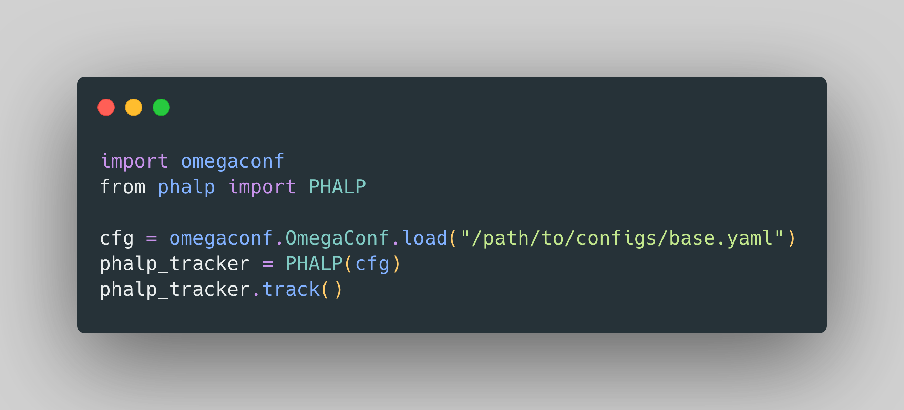

# Tracking People by Predicting 3D Appearance, Location & Pose (CVPR 2022 Oral)
Code repository for the paper "Tracking People by Predicting 3D Appearance, Location & Pose". \
[Jathushan Rajasegaran](http://people.eecs.berkeley.edu/~jathushan/), [Georgios Pavlakos](https://geopavlakos.github.io/), [Angjoo Kanazawa](https://people.eecs.berkeley.edu/~kanazawa/), [Jitendra Malik](http://people.eecs.berkeley.edu/~malik/). \
[](https://arxiv.org/abs/2112.04477)       [](https://people.eecs.berkeley.edu/~jathushan/PHALP/)     [](https://colab.research.google.com/drive/1zeHvAcvflsty2p9Hgr49-AhQjkSWCXjr?usp=sharing)
 
This code repository provides a code implementation for our paper PHALP, with installation, preparing datasets, and evaluating on datasets, and a demo code to run on any youtube videos. 

<p align="center"></p>

**Abstract** : <em>In this paper, we present an approach for tracking people in monocular videos, by predicting their future 3D representations. To achieve this, we first lift people to 3D from a single frame in a robust way. This lifting includes information about the 3D pose of the person, his or her location in the 3D space, and the 3D appearance. As we track a person, we collect 3D observations over time in a tracklet representation. Given the 3D nature of our observations, we build temporal models for each one of the previous attributes. We use these models to predict the future state of the tracklet, including 3D location, 3D appearance, and 3D pose. For a future frame, we compute the similarity between the predicted state of a tracklet and the single frame observations in a probabilistic manner. Association is solved with simple Hungarian matching, and the matches are used to update the respective tracklets. We evaluate our approach on various benchmarks and report state-of-the-art results. </em> 

## Installation

### Basic installation
We recommend creating a clean [conda](https://docs.conda.io/) environment and install all dependencies.
You can do this as follows:
```
git clone https://github.com/brjathu/PHALP.git
git checkout v1.1
conda env create -f env.yaml
conda activate PHALP
```

This is sufficient for running our code from demo and on supported dataset. However, if you want to use the code inside your own code snippet, you can install the package by running the following command. This will install the package in the current environment. This will allow you to use the package in your own code.

```
pip install -e .
```

### PHALP package installation

For using PHALP in your code, you can use the following code snippet. First, please install [PyTorch](https://pytorch.org/get-started/locally/) from offical website. Then install the package by running the following command. Afterward, you can use the package in your code as shown below.

```
pip install PHALP
```

If you want to use the code inside your own code snippet, you can use the following code to run the tracker on a video. output will be saved in `_OUT/` folder. 

<p align="center"></p>


## Demo

Please run the following command to run our method on a youtube video. This will download the youtube video from a given ID, and extract frames, run Detectron2, run HMAR and finally run our tracker and renders the video.

```
python scripts/demo.py video.source=\'"https://www.youtube.com/watch?v=xEH_5T9jMVU"\'
```

By default we spport PyRender, and the rendering type is set to `HUMAN_MESH`. You can change the rendering type to `GHOST` to see the continuous tracks, even if it is not detected or occluded. Also you can change the rendering type to `HUMAN_MASK` to visualize the segmentation mask of the person, for fast visualization. 

```
python scripts/demo.py video.source=\'"https://www.youtube.com/watch?v=xEH_5T9jMVU"\' render.type=HUMAN_MASK
```

<p align="center"></p>

For debugging purposes, you can set `debug=True` to disable rich progress bar.

```
python scripts/demo.py video.source=\'"https://www.youtube.com/watch?v=xEH_5T9jMVU"\' phalp.end_frame=100 debug=True
```


<!-- ```
import omegaconf
from phalp import PHALP

cfg = omegaconf.OmegaConf.load("/path/to/configs/base.yaml")
phalp_tracker = PHALP(cfg)
phalp_tracker.track()
``` -->


<!-- Also, you can render with different renders (NMR or PyRender) with different visualization by changing `render_type` option. Additionally, you can also replace `HUMAN` with `GHOST` to see the continuous tracks, even if it is not detected or occluded. -->


<!-- 
## Testing

Once the posetrack dataset is downloaded at "_DATA/posetrack_2018/", run the following command to run our tracker on all videos on the supported datasets. This will run MaskRCNN, HMAR to create embeddings and run PHALP on these prepossessed data. 

`./scripts/_posetrack.sh`


## Evaluation

To evaluate the tracking performance on ID switches, MOTA, and IDF1 and HOTA metrics, please run the following command.

`python3 evaluate_PHALP.py out/Videos_results/results/ PHALP posetrack` -->


## Results ([Project site](http://people.eecs.berkeley.edu/~jathushan/PHALP/))

We evaluated our method on PoseTrack, MuPoTs and AVA datasets. Our results show significant improvements over the state-of-the-art methods on person tracking. For more results please visit our [website](http://people.eecs.berkeley.edu/~jathushan/PHALP/).

<p align="center"></p>
<p align="center"></p>
<p align="center"></p>
<p align="center"></p>
<p align="center"></p>
<p align="center"></p>
<p align="center"></p>
<p align="center"></p>

## Acknowledgements
Parts of the code are taken or adapted from the following repos:
- [deep sort](https://github.com/nwojke/deep_sort)
- [SMPL-X](https://github.com/vchoutas/smplx)
- [SMPLify-X](https://github.com/vchoutas/smplify-x)
- [SPIN](https://github.com/nkolot/SPIN)
- [VIBE](https://github.com/mkocabas/VIBE)
- [SMALST](https://github.com/silviazuffi/smalst)
- [ProHMR](https://github.com/nkolot/ProHMR)
- [TrackEval](https://github.com/JonathonLuiten/TrackEval)

## Contact
Jathushan Rajasegaran - jathushan@berkeley.edu or brjathu@gmail.com
<br/>
To ask questions or report issues, please open an issue on the [issues tracker](https://github.com/brjathu/PHALP/issues).
<br/>
Discussions, suggestions and questions are welcome!


## Citation
If you find this code useful for your research or the use data generated by our method, please consider citing the following paper:
```
@inproceedings{rajasegaran2022tracking,
  title={Tracking People by Predicting 3{D} Appearance, Location \& Pose},
  author={Rajasegaran, Jathushan and Pavlakos, Georgios and Kanazawa, Angjoo and Malik, Jitendra},
  booktitle={CVPR},
  year={2022}
}
```

