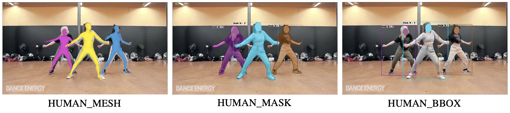

# Tracking People by Predicting 3D Appearance, Location & Pose
Code repository for the paper "Tracking People by Predicting 3D Appearance, Location & Pose". \
[Jathushan Rajasegaran](http://people.eecs.berkeley.edu/~jathushan/), [Georgios Pavlakos](https://geopavlakos.github.io/), [Angjoo Kanazawa](https://people.eecs.berkeley.edu/~kanazawa/), [Jitendra Malik](http://people.eecs.berkeley.edu/~malik/). \
[](https://arxiv.org/abs/2112.04477)       [](https://people.eecs.berkeley.edu/~jathushan/PHALP/)     [](https://colab.research.google.com/drive/1-zA9ntIkSj94zgfeeghg0lWEIihzk-XS?usp=sharing)

This code repository provides a code implementation for our paper PHALP, with installation, a demo code to run on any videos, preparing datasets, and evaluating on datasets.

<b>This branch contains code supporting our latest work: [4D-Humans](https://github.com/shubham-goel/4D-Humans). <br>
For the original PHALP code, please see the [initial release branch](https://github.com/brjathu/PHALP/tree/initial_release).</b>

<p align="center"></p>

## Installation

After installing the [PyTorch](https://pytorch.org/get-started/locally/) dependency, you may install our `phalp` package directly as:
```
pip install phalp[all]@git+https://github.com/brjathu/PHALP.git
```

<details>
  <summary>Step-by-step instructions</summary>

```bash
git clone https://github.com/brjathu/PHALP.git
cd PHALP
conda create -n phalp python=3.10
conda activate phalp
conda install pytorch==1.13.1 torchvision==0.14.1 torchaudio==0.13.1 pytorch-cuda=11.6 -c pytorch -c nvidia
pip install -e .[all]
```
</details>
<br>

## Demo

To run our code on a video, please specifiy the input video `video.source` and an output directory `video.output_dir`:
```bash
python scripts/demo.py video.source=assets/videos/gymnasts.mp4 video.output_dir='outputs'
```
The output directory will contain a video rendering of the tracklets and a `.pkl` file containing the tracklets with 3D pose and shape (see structure below).
<br>

## Command-line options

### Input Sources

You can specify various kinds of input sources. For example, you can specify a video file, a youtube video, a directory of images:
```bash
# for a video file
python scripts/demo.py video.source=assets/videos/vid.mp4

# for a youtube video
python scripts/demo.py video.source=\'"https://www.youtube.com/watch?v=xEH_5T9jMVU"\'

# for a directory of images
python scripts/demo.py video.source=<dirtory_path>
```
<details>
  <summary>Custom bounding boxes</summary>

In addition to these options, you can also give images and bounding boxes as inputs, so the model will only do tracking using the given bounding boxes. To do this, you need to specify the `video.source` as a `.pkl` file, where each key is the frame name and the absolute path to the image is computed as `os.path.join(video.base_path, frame_name)`. The value of each key is a dictionary with the following keys: `gt_bbox`, `gt_class`, `gt_track_id`. Please see the following example. `gt_boxes` is a `np.ndarray` of shape `(N, 4)` where each row is a bounding box in the format of `[x1, y1, x2, y2]`. You can also give `gt_class` and `gt_track_id` to store it in the final output.

```python
 gt_data[frame_id] = {
                        "gt_bbox": gt_boxes,
                        "extra_data": {
                            "gt_class": [],
                            "gt_track_id": [],
                        }
                    }
```
</details>
<br>

### Running on a subset of frames
You can specify the start and end of the video to be tracked, e.g. track from frame 50 to 100:
```bash
python scripts/demo.py video.source=assets/videos/vid.mp4 video.start_frame=50 video.end_frame=100
```

<details>
  <summary>Tracking without extracting frames</summary>

  However, if the video is too long and extracting the frames is too time consuming, you can set `video.extract_video=False`. This will use the torchvision backend and it will only keep the timestamps of the video in memeory. If this is enabled, you can give start time and end time of the video in seconds.

  ```bash
  python scripts/demo.py video.source=assets/videos/vid.mp4 video.extract_video=False video.start_time=1s video.end_time=2s
  ```

</details>
<br>

### Visualization type
  We support multiple types of visualization in `render.type`: `HUMAN_MESH` (default) renders the full human mesh, `HUMAN_MASK` visualizes the segmentation masks, `HUMAN_BBOX` visualizes the bounding boxes with track-ids, `TRACKID_<id>_MESH` renders the full human mesh but for track `<id>` only:
  ```bash
  # render full human mesh
  python scripts/demo.py video.source=assets/videos/vid.mp4 render.type=HUMAN_MESH

  # render segmentation mask
  python scripts/demo.py video.source=assets/videos/vid.mp4 render.type=HUMAN_MASK

  # render bounding boxes with track-ids
  python scripts/demo.py video.source=assets/videos/vid.mp4 render.type=HUMAN_BBOX

  # render a single track id, say 0
  python scripts/demo.py video.source=assets/videos/vid.mp4 render.type=TRACKID_0_MESH
  ```

  <!-- To see all the rendering types, please see the following figure. -->
  <p align="center"></p>

<details>
  <summary>More rendering types</summary>
  In addition to these setting, for rendering meshes, PHALP uses head-mask visiualiztion, which only renders the upper body on the person to allow users to see the actually person and the track in the same video. To enable this, please set `render.head_mask=True`.

  ```bash
  # for rendering detected and occluded people
  python scripts/demo.py video.source=assets/videos/vid.mp4 render.head_mask=True
  ```

  You can also visualize the 2D projected keypoints by setting `render.show_keypoints=True` [TODO].

</details>
<br>

### Track through shot-boundaries

By default, PHALP does not track through shot boundaries. To enable this, please set `detect_shots=True`.

```bash
# for tracking through shot boundaries
python scripts/demo.py video.source=assets/videos/vid.mp4 detect_shots=True
```

<details>
  <summary>Additional Notes</summary>

  * For debugging purposes, you can set `debug=True` to disable rich progress bar.

</details>


<br>

## Output `.pkl` structure
The `.pkl` file containing tracks, 3D poses, etc. is stored under `<video.output_dir>/results`, and is a 2-level dictionary:

<details>
<summary>Detailed structure</summary>

```python
import joblib
results = joblib.load(<video.output_dir>/results/<video_name>.pkl)
results = {
  # A dictionary for each frame.
  'vid_frame0.jpg': {
    '2d_joints':       List[np.array(90,)],   # 45x 2D joints for each detection
    '3d_joints':       List[np.array(45,3)],  # 45x 3D joints for each detection
    'annotations':     List[Any],             # custom annotations for each detection
    'appe':            List[np.array(4096,)], # appearance features for each detection
    'bbox':            List[[x0 y0 w h]],     # 2D bounding box (top-left corner and dimensions) for each track (detections + ghosts)
    'camera':          List[[tx ty tz]],      # camera translation (wrt image) for each detection
    'camera_bbox':     List[[tx ty tz]],      # camera translation (wrt bbox) for each detection
    'center':          List[[cx cy]],         # 2D center of bbox for each detection
    'class_name':      List[int],             # class ID for each detection (0 for humans)
    'conf':            List[float],           # confidence score for each detection
    'frame_path':      'vid_frame0.jpg',      # Frame identifier
    'loca':            List[np.array(99,)],   # location features for each detection
    'mask':            List[mask],            # RLE-compressed mask for each detection
    'pose':            List[np.array(229,)],  # pose feature (concatenated SMPL params) for each detection
    'scale':           List[float],           # max(width, height) for each detection
    'shot':            int,                   # Shot number
    'size':            List[[imgw imgh]],     # Image dimensions for each detection
    'smpl':            List[Dict_SMPL],       # SMPL parameters for each detection: betas (10), body_pose (23x3x3), global_orient (3x3)
    'tid':             List[int],             # Track ID for each detection
    'time':            int,                   # Frame number
    'tracked_bbox':    List[[x0 y0 w h]],     # 2D bounding box (top-left corner and dimensions) for each detection
    'tracked_ids':     List[int],             # Track ID for each detection
    'tracked_time':    List[int],             # for each detection, time since it was last seen
  },
  'vid_frame1.jpg': {
    ...
  },
  ...
}
```
</details>
<br>

## Postprocessing pipeline

Coming soon.


<br>

## Training and Evaluation

Coming soon.


## Acknowledgements
Parts of the code are taken or adapted from the following repos:
- [deep sort](https://github.com/nwojke/deep_sort)
- [SMPL-X](https://github.com/vchoutas/smplx)
- [SMPLify-X](https://github.com/vchoutas/smplify-x)
- [SPIN](https://github.com/nkolot/SPIN)
- [VIBE](https://github.com/mkocabas/VIBE)
- [SMALST](https://github.com/silviazuffi/smalst)
- [ProHMR](https://github.com/nkolot/ProHMR)
- [TrackEval](https://github.com/JonathonLuiten/TrackEval)

## Citation
If you find this code useful for your research or the use data generated by our method, please consider citing the following paper:
```bibtex
@inproceedings{rajasegaran2022tracking,
  title={Tracking People by Predicting 3{D} Appearance, Location \& Pose},
  author={Rajasegaran, Jathushan and Pavlakos, Georgios and Kanazawa, Angjoo and Malik, Jitendra},
  booktitle={CVPR},
  year={2022}
}
```
